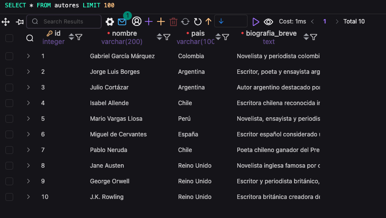
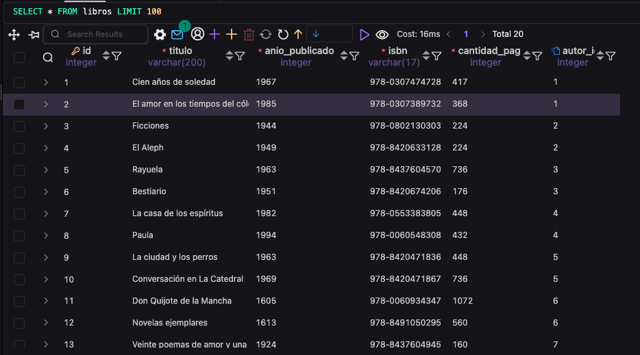
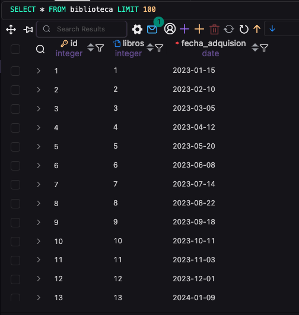

# Biblioteca Personal — Base de Datos

## Descripción del schema

El sistema gestiona una colección personal de libros. Se identificaron tres entidades principales:

- **Autores**: personas que escribieron los libros. Cada autor tiene nombre, país de origen y una biografía breve.
- **Libros**: cada libro pertenece a un único autor. Tiene título, año de publicación, ISBN, cantidad de páginas, y una referencia al autor.
- **Biblioteca**: representa los libros que forman parte de la colección personal, con la fecha en que fueron adquiridos.

La relación principal es **uno a muchos** entre Autores y Libros: un autor puede tener varios libros, pero cada libro tiene un solo autor. La tabla Biblioteca referencia a Libros para registrar cuándo se adquirió cada uno; el autor se puede obtener navegando la relación Biblioteca → Libros → Autores mediante JOIN.

---

## Diagrama del schema

```
Autores
- id              SERIAL, PK
- nombre          VARCHAR(200), NOT NULL
- pais            VARCHAR(100), NOT NULL
- biografia_breve TEXT, NOT NULL

Libros
- id              SERIAL, PK
- titulo          VARCHAR(200), NOT NULL
- anio_publicado  INTEGER, NOT NULL
- isbn            VARCHAR(17), UNIQUE, NOT NULL
- cantidad_pag    INTEGER, NOT NULL
- autor_id        INTEGER, FK → autores(id)

Biblioteca
- id              SERIAL, PK
- libros          INTEGER, FK → libros(id)
- fecha_adquision DATE, NOT NULL
```

---

## Instrucciones de setup

```sql
-- 1. Conectarse a PostgreSQL como superusuario
psql -U postgres

-- 2. Crear la base de datos
CREATE DATABASE biblioteca_personal;

-- 3. Conectarse a la base de datos
\c biblioteca_personal

-- 4. Crear usuario específico
CREATE USER biblioteca_user WITH PASSWORD 'tu_contraseña';

-- 5. Otorgar permisos
GRANT ALL PRIVILEGES ON DATABASE biblioteca_personal TO biblioteca_user;
GRANT ALL PRIVILEGES ON SCHEMA public TO biblioteca_user;
ALTER DEFAULT PRIVILEGES IN SCHEMA public GRANT ALL ON TABLES TO biblioteca_user;
ALTER DEFAULT PRIVILEGES IN SCHEMA public GRANT ALL ON SEQUENCES TO biblioteca_user;

-- 6. Crear las tablas
\i schema.sql

-- 7. Verificar
\dt
\d autores
\d libros
\d biblioteca
```

---

## Decisiones de diseño

**VARCHAR con límites razonables**
Se usó `VARCHAR(200)` para títulos y nombres porque es un largo más que suficiente para cualquier caso real, sin desperdiciar espacio. Para `pais` se eligió `VARCHAR(100)` ya que los nombres de países son considerablemente más cortos. Para `isbn` se usó `VARCHAR(17)` porque el formato ISBN-13 con guiones ocupa exactamente ese largo máximo.

**TEXT para biografia_breve**
Se eligió `TEXT` en lugar de `VARCHAR(X)` porque una biografía puede tener longitud muy variable y no tiene sentido imponerle un límite arbitrario.

**isbn como VARCHAR y no INTEGER**
Inicialmente se había pensado en INTEGER, pero los ISBNs contienen guiones y pueden empezar con cero, por lo que VARCHAR es el tipo correcto. Además se marcó como `UNIQUE` porque no pueden existir dos libros con el mismo ISBN.

**NOT NULL en la mayoría de los campos**
Todos los campos de datos principales se marcaron como `NOT NULL` porque son información esencial. No tiene sentido registrar un libro sin título, ni un autor sin nombre.

**autor_id permite NULL en Libros**
Se dejó `autor_id` sin `NOT NULL` para permitir registrar libros cuyo autor se desconoce o es anónimo, sin que eso rompa la integridad de la base de datos.

**La tabla Biblioteca no repite el autor**
En el primer diseño se había incluido el autor directamente en Biblioteca, pero eso generaba información duplicada. El autor ya está en Libros, así que se puede obtener con un JOIN sin necesidad de guardarlo dos veces.

## Capturas de pantalla



